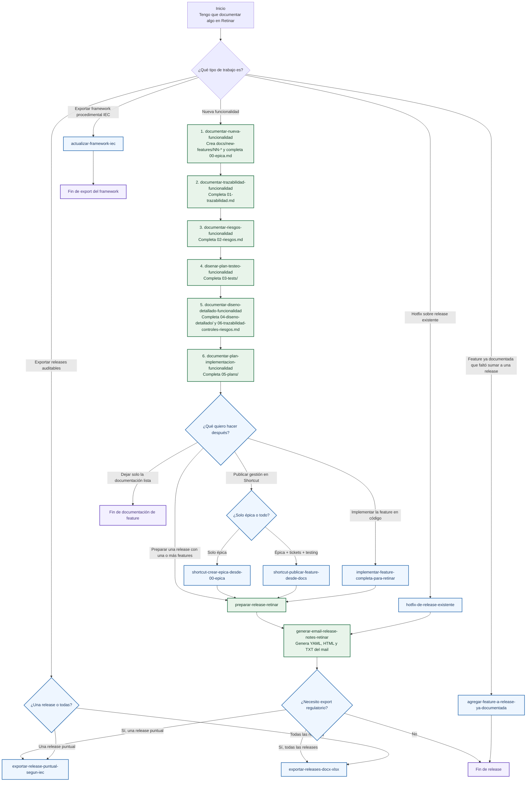

# Mapa visual de orden de ejecución de skills de documentación de Retinar

Este mapa resume el orden recomendado para usar las skills que hoy tenemos desarrolladas alrededor de la documentación de producto, releases y export regulatorio de Retinar.

## Flujo visual

## Orden recomendado para una feature nueva

1. `documentar-nueva-funcionalidad`
2. `documentar-trazabilidad-funcionalidad`
3. `documentar-riesgos-funcionalidad`
4. `disenar-plan-testeo-funcionalidad`
5. `documentar-diseno-detallado-funcionalidad`
6. `documentar-plan-implementacion-funcionalidad`
7. Opcional: publicar en Shortcut
8. Opcional: `implementar-feature-completa-para-retinar`
9. `preparar-release-retinar`
10. `generar-email-release-notes-retinar`
11. Opcional: export regulatorio de la release

## Por qué este orden

- `01-trazabilidad.md` depende de que `00-epica.md` ya esté bien cerrada.
- `02-riesgos.md` depende de la épica y de la trazabilidad.
- `03-tests/` conviene diseñarlo antes del diseño detallado para que QA quede incorporado al razonamiento de diseño.
- `04-diseno-detallado/` ya usa épica, trazabilidad, riesgos y tests como insumo.
- `05-plans/` queda mucho mejor cuando el diseño ya aterrizó unidades, arquitectura y alcance real.
- La release recién conviene prepararla cuando la feature ya está documentada de punta a punta.

## Atajos y desvíos importantes

- Si la feature ya existe y solo faltó incorporarla a una release ya documentada, usar `agregar-feature-a-release-ya-documentada`.
- Si el cambio es un fix puntual sobre una release existente, usar `hotfix-de-release-existente` en vez del flujo de feature nueva.
- Si no estás preparando una release sino solo exportando evidencia ya existente, ir directo a `exportar-release-puntual-segun-iec` o `exportar-releases-docx-xlsx`.
- Si lo que necesitás es regenerar los procedimientos del framework IEC 62304, usar `actualizar-framework-iec`.

## Archivos generados por cada tramo

- Feature nueva:
  `docs/new-features/NN-*/00-epica.md`
  `01-trazabilidad.md`
  `02-riesgos.md`
  `03-tests/`
  `04-diseno-detallado/`
  `05-plans/`
  `06-trazabilidad-controles-riesgos.md`
- Release:
  `docs/releases/vX.Y.Z/`
  `07-release-notes-email/`
- Export regulatorio:
  `docs/releases_export/`
- Framework IEC:
  `docs/framework-iec62304/export/`

## Artefactos de este mapa

- Fuente Mermaid: [skills-retinar-orden-ejecucion.mmd](/Users/ignaciorlando/Documents/retinar-website/docs/skills-retinar-orden-ejecucion.mmd)
- Esta guía: [skills-retinar-orden-ejecucion.md](/Users/ignaciorlando/Documents/retinar-website/docs/skills-retinar-orden-ejecucion.md)
